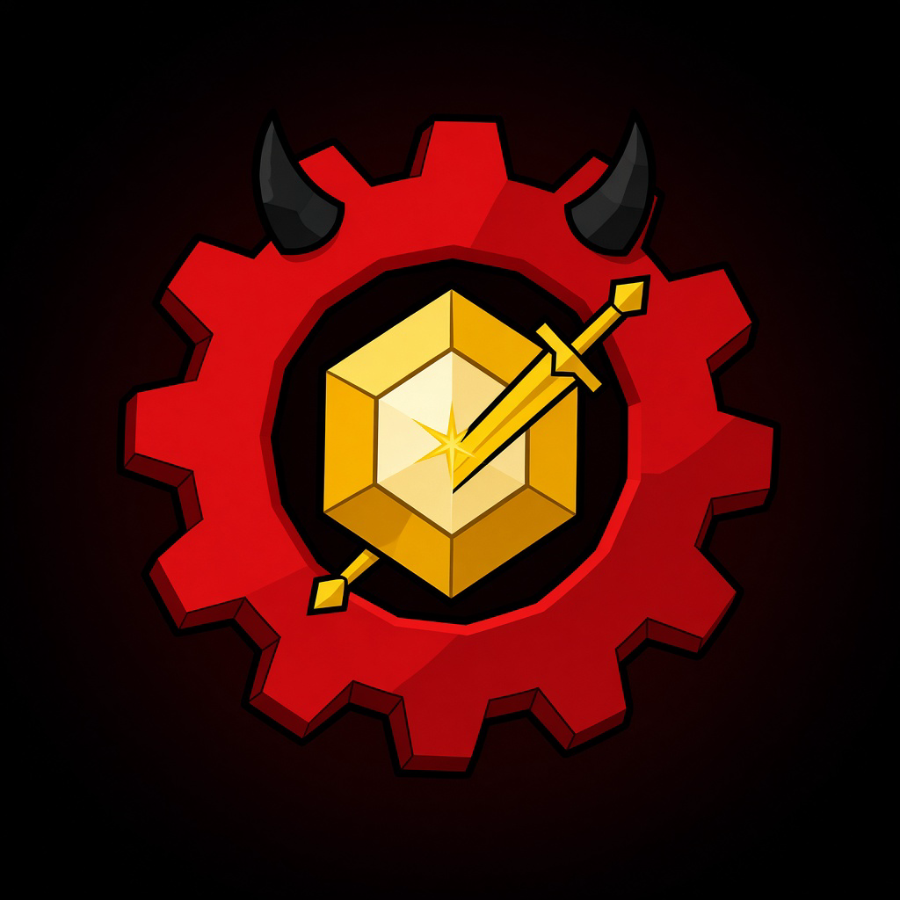
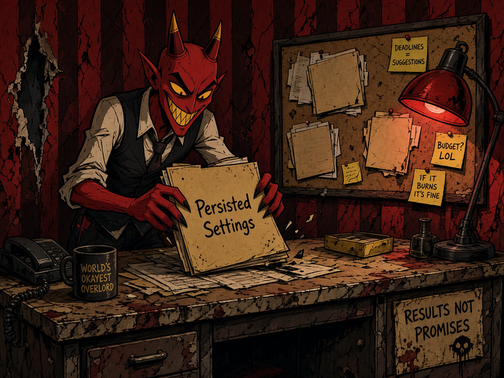
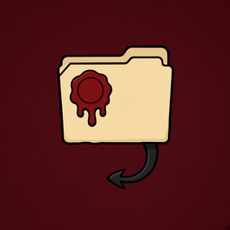

# LoL Settings Changer

<p align="center">
  
</p>

<p align="center">
  
</p>

<p align="center">
  <strong>v0.2.0</strong> · Windows x64 · local-only League settings desk<br>
  Save, apply, and restore <code>PersistedSettings.json</code> profiles without a Riot login.
</p>

<p align="center">
  <a href="https://github.com/gfaraujosousa/lol-settings-changer/releases"></a>
  <a href="LICENSE"></a>
  
  
  <a href="https://ko-fi.com/notbielson"></a>
</p>

LSC is a small Windows desktop app for players who juggle more than one League account, or who keep a shared settings preset and want to swap it safely. It never uploads your file, never asks for a Riot password, and writes a backup before every apply or restore.

Not affiliated with Riot Games. Original LSC artwork — no copied game or show assets.

---

<p align="center">
  
</p>

<p align="center"><em>The job desk mascot. Contracts stay on this PC.</em></p>

---

## Features

- Point the desk at League’s `PersistedSettings.json` and validate it before use.
- Save the current setup as a **shared** profile or an **account** profile, with an optional badge.
- Apply a saved profile through a safe write path (backup first).
- Restore a recent backup from the History tab if a swap goes wrong.
- Compact activity log for save / apply / restore (details on hover).
- Recover a damaged local profile or activity file without overwriting the broken copy.
- In-app **News** from GitHub releases (or recent commits if none exist yet).
- Auto-update check on launch; install the NSIS setup from the latest GitHub release.
- Keep the app in the system tray; release builds hide the Windows console.
- UI in English, Portuguese, Spanish, French, Simplified Chinese, Korean, and German.

### Profile badges

<p align="center">
  
  
  
  
  
</p>

Assign one of five original badges when you save or edit a profile.

---

## How to use

1. **Start** — four short steps. No Riot login. The settings file never leaves this PC.
2. **Desk** — select `PersistedSettings.json`. The header chip turns **Ready** when the path is safe. Save the current setup, then apply a profile later.
3. **History** — recent backups and a one-line activity log. Restore a backup if the swap goes wrong.
4. **News** — changelog from GitHub, plus a manual **Check for updates**.

Close the League client **before** applying a profile.

Typical file location:

```text
C:\Riot Games\League of Legends\Config\PersistedSettings.json
```

---

## Safety

This app treats settings files as user data:

- JSON is validated before writes.
- A backup is created before apply/restore writes.
- Failed writes keep a recovery path.
- Activity entries use friendly messages and do not store raw settings JSON.
- No Riot login, cloud sync, telemetry, or credential storage.

---

## Updates

On launch, LSC checks the latest GitHub release. If a newer version exists, a banner offers **Install update**, which downloads the Windows NSIS setup and starts the installer. The version chip in the header and the News tab run the same check on demand. You can skip a version; details stay on the [Releases](https://github.com/gfaraujosousa/lol-settings-changer/releases) page if the download cannot start.

Install Windows builds from those releases (`LoL Settings Changer_<version>_x64-setup.exe`).

---

## Development

Prerequisites:

- Node.js 20+
- Rust via rustup (`stable-x86_64-pc-windows-msvc`)
- Visual Studio Build Tools with the C++ workload (Windows)

```bash
npm ci
npm test
npm run build
npm run tauri:build
```

Release artifacts land in `src-tauri/target/release/bundle/`.

Pushing a tag like `v0.2.0` runs CI, builds the Windows installer, and publishes it to a GitHub Release.

---

## Support

If the desk saves you a few clicks, you can [buy me a coffee on Ko-fi](https://ko-fi.com/notbielson).

## License

[MIT](LICENSE)
